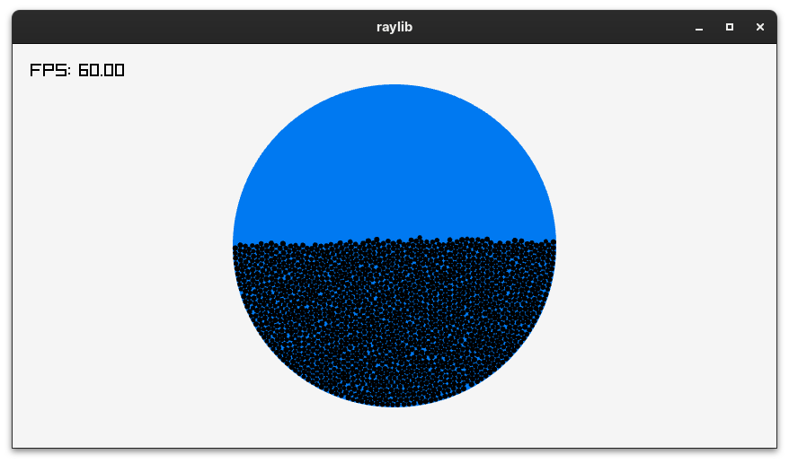

# Ball Simulation

A cross-platform ball simulation written in C (gnu17).

## Build
If you are on a platform without a common C compilation toolchain, run 
`./scripts/environment.sh` and enter this directory again.
To compile and run, execute `make && ./game` in your shell.

